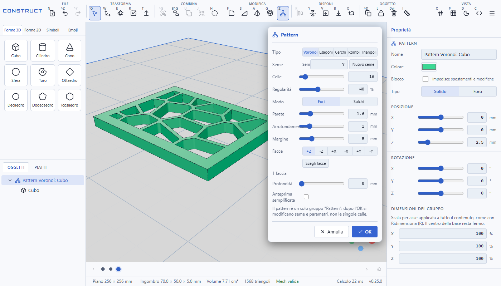
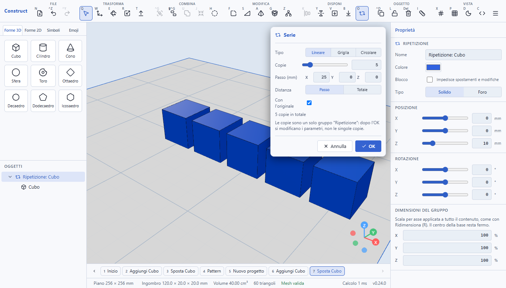
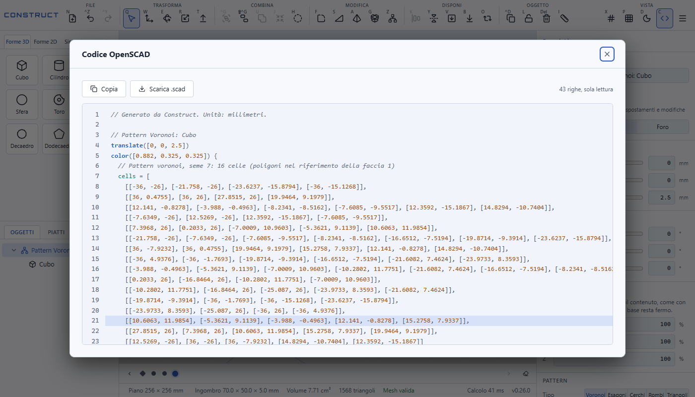

# Construct

Editor CAD 3D nel browser pensato per la stampa 3D. Si costruisce il modello con forme, booleane e strumenti di dettaglio, si vede il risultato dal vivo e si esporta sia la mesh (STL, 3MF) sia il **codice OpenSCAD** equivalente, che si può aprire e modificare altrove.

Tutto gira nel browser: il calcolo geometrico usa [manifold-3d](https://github.com/elalish/manifold) (WebAssembly) in un Web Worker, il progetto si salva in locale e l'app funziona anche offline come PWA.



## Funzioni principali

- **Forme**: cubo, cilindro, cono, sfera, toro, poliedri regolari, forme 2D estrudibili (cerchio, quadrato, poligoni), testo con una quarantina di font di Google Fonts, simboli, emoji e import di **SVG**, **STL** e **3MF**.
- **Booleane**: unione, differenza, intersezione, inviluppo convesso e fori; gli operandi si possono vedere in trasparenza, come il `#` di OpenSCAD.
- **Strumenti di dettaglio**: Raccordo, Smusso e Smusso angolare con anteprima dal vivo, Guscio, Appoggia su una faccia, Allinea, Specchia e Misura con aggancio a vertici e spigoli.
- **Serie** (lineare, griglia, circolare): il risultato è un gruppo parametrico "Ripetizione", si modificano i parametri e non le singole copie.
- **Pattern**: fora un pezzo con celle **Voronoi casuali** riproducibili da un seme, **esagoni**, **cerchi**, **rombi** o **triangoli**, da una o più facce (anche scelte con il clic), passanti o a tasca, con parete, arrotondamento e margine regolabili. Un avviso segnala i calcoli lenti e l'anteprima semplificata li accelera.
- **Codice OpenSCAD** sempre aggiornato, con `for()`, `offset()`, `hull()`, `rotate_extrude()` e le celle dei pattern già calcolate, così il risultato coincide con quello dell'app. Con più piatti il codice ha un `module piatto_N()` per piatto.
- **Importa OpenSCAD**: un file `.scad` si legge come codice (cubi, sfere, cilindri, translate/rotate/scale/mirror/multmatrix/resize, booleane, `hull`, `offset`, `linear_extrude` e `rotate_extrude` di cerchi, quadrati e poligoni anche con fori, `text`, `for`, `if`, `let`, liste per comprensione, variabili, funzioni, moduli con `children()`) e diventa oggetti veri; il codice generato da Construct si rilegge, piatti compresi. Quello che non si capisce (`polyhedron`, `import`, `projection`, `surface`) si salta con un avviso.
- **Documentazione** nel menu: manuale d'uso con indice e FAQ, raggiungibile anche dalla schermata di benvenuto.
- **Impostazioni** dal menu: tema, piano di stampa, quote, passi di spostamento e rotazione, salvataggio automatico, benvenuto; ripristino delle opzioni e pulizia completa dei dati salvati nel browser.
- **Piano di stampa** configurabile (256 × 256 mm di default) dalla barra di stato, con una tendina delle stampanti (misura per prima, poi le stampanti che la hanno: Bambu Lab A1 mini, A1, P1S, P1P, X1C e H2D, Prusa, Creality, Anycubic ed Elegoo) e **Ridimensiona** su qualsiasi gruppo (unione, guscio, serie, pattern...) con il gizmo o dalle proprietà.
- **Quote cliccabili**: l'oggetto selezionato mostra le misure X, Y e Z nella vista; un clic su una quota permette di digitare il valore in mm, senza passare dal pannello laterale, e il lucchetto accanto le fa scalare tutte in proporzione.
- **Menu contestuale** con il tasto destro: su un oggetto elenca solo i comandi che hanno senso per lui (Raggruppa con due o più oggetti, Separa su un gruppo, niente raccordi su una sfera...); nel vuoto ha sottomenu a destra per aggiungere nel punto cliccato una forma 3D o 2D, un simbolo o un'emoji, più le voci Importa, Esporta, Dimensioni del piano e Schermata di benvenuto.
- **Piatti**: un progetto può avere più piatti di stampa (scheda **Piatti** accanto a **Oggetti**), ciascuno con i suoi oggetti, per esempio la scatola sul primo e il coperchio sul secondo. Si vede un piatto alla volta; il 3MF esporta tutti i piatti affiancati e l'STL chiede quale piatto esportare.
- **Schermata di benvenuto** al primo avvio (e dal menu): progetto vuoto, partire da un cubo, importare un file (i modelli di esempio arriveranno).
- **Timeline** a indicatori con il nome dell'operazione nel tooltip e un'icona per svuotare la cronologia.
- **Barra strumenti a sezioni** (File, Trasforma, Combina, Modifica, Disponi, Oggetto, Vista), con il nome del gruppo sopra i pulsanti.
- **Cronologia** con Annulla e Ripeti (un solo passo per operazione) e linea del tempo.
- **Tooltip dettagliati** su ogni comando della barra: cosa fa, come si applica e, per i comandi più complessi, un'immagine di esempio.





## Avvio

Servono [Node.js](https://nodejs.org) (sviluppato con Node 26) e npm.

```bash
npm install
npm run dev        # server di sviluppo su http://localhost:5173
```

Altri comandi:

```bash
npm run typecheck  # controllo dei tipi TypeScript
npm test           # test unitari (Vitest)
npm run test:e2e   # test end-to-end (Playwright, costruisce l'app in modalità e2e)
npm run build      # build di produzione in dist/ (con service worker per l'uso offline)
npm run preview    # serve la build di produzione
```

Le immagini dei tooltip e del README si rigenerano con:

```bash
DOC_IMAGES=1 npx playwright test e2e/docs-images.spec.ts
```

## Pubblicazione

Ogni push su `main` avvia la GitHub Action `.github/workflows/deploy.yml`: build di produzione e sincronizzazione via rsync su SSH in `public_html/` di [construct.mavida.com](https://construct.mavida.com), con mail di esito. Servono i secret del repo `SSH_HOST`, `SSH_USERNAME`, `SSH_PASSWORD`, `RESEND_API_KEY` e `VITE_API_BASE_URL` (quest'ultimo non è ancora usato dall'app).

## Scorciatoie

Le principali: `Q` Seleziona, `W` Sposta, `E` Ruota, `R` Ridimensiona, `T` Estrudi, `U` Unisci, `J` Inviluppo, `Maiusc+J` Minkowski, `H` Foro, `F` Raccordo, `S` Smusso, `A` Smusso angolare, `G` Guscio, `K` Allinea, `Y` Specchia, `I` Misura, `O` Serie, `Z` Pattern, `V` Appoggia su una faccia, `B` Appoggia sul piatto, `C` Codice OpenSCAD. L'elenco completo è nel menu dell'app e nel tooltip di ogni pulsante.

## Struttura del progetto

```
src/
  scene/      modello della scena (nodi, store, cronologia) e calcoli puri: raccordi, guscio, serie, pattern, Voronoi
  kernel/     calcolo geometrico con manifold-3d in un Web Worker
  codegen/    generatore del codice OpenSCAD
  import/     lettura di STL, 3MF e SVG
  viewport/   vista 3D (React Three Fiber), selezione, gizmo e overlay degli strumenti
  ui/         barra (registro dei comandi in commands.tsx), menu contestuale, pannelli degli strumenti, proprietà, libreria forme, linea del tempo
e2e/          test end-to-end con Playwright
docs/         studi di fattibilità, elenco delle cose da fare e fonti
```

Il [CHANGELOG](CHANGELOG.md) documenta ogni versione e [docs/da-fare.md](docs/da-fare.md) raccoglie le funzioni previste e il confronto con Tinkercad, Fusion e Blender.

## Licenza e crediti

Il codice è rilasciato con licenza [MIT](LICENSE). Il progetto usa, tra gli altri, [manifold-3d](https://github.com/elalish/manifold) (Apache 2.0), [three.js](https://threejs.org) e React Three Fiber (MIT), [opentype.js](https://github.com/opentypejs/opentype.js) (MIT) e icone [Lucide](https://lucide.dev) (ISC). I font inclusi in `src/assets/fonts` provengono da Google Fonts con licenza SIL Open Font License 1.1 (vedi `src/assets/fonts/README.md`).
